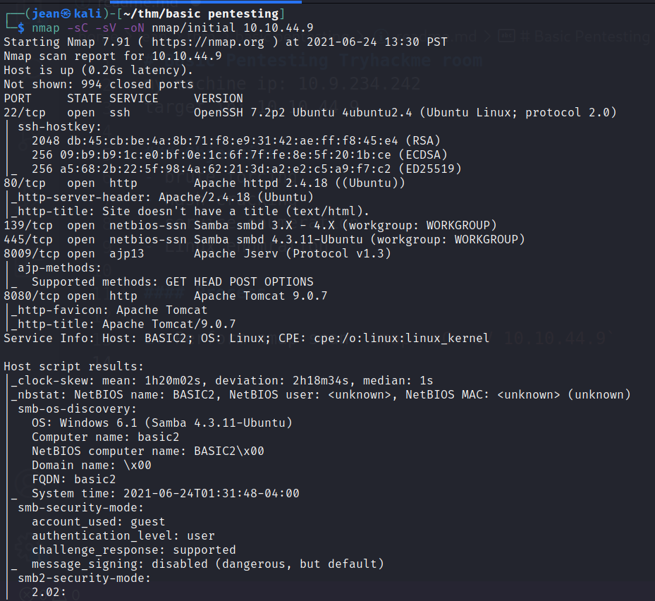
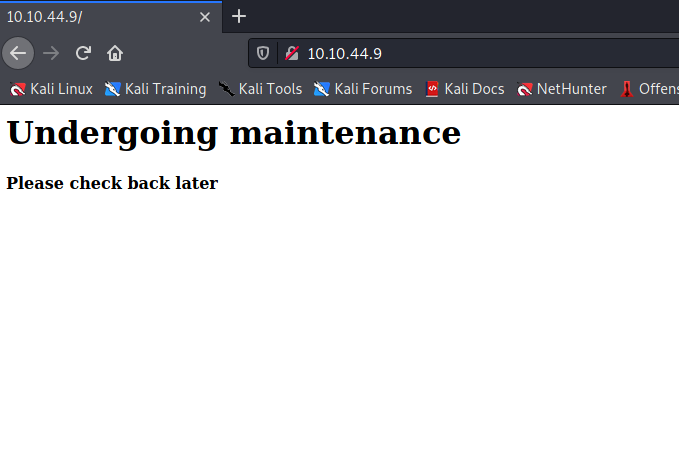
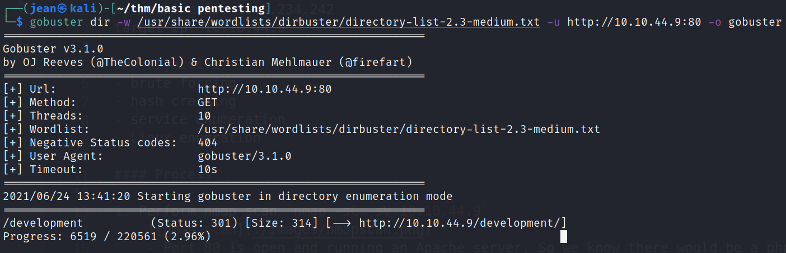
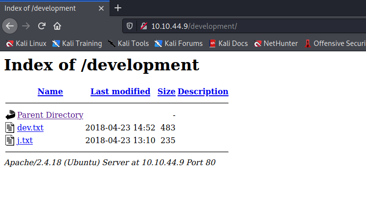
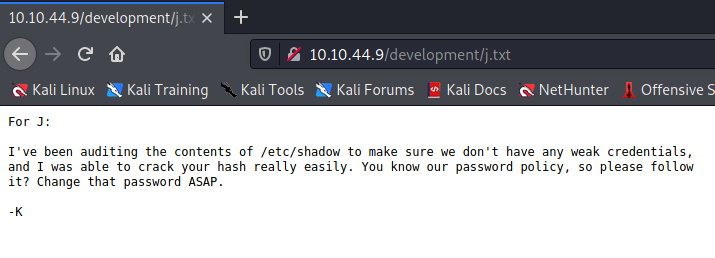
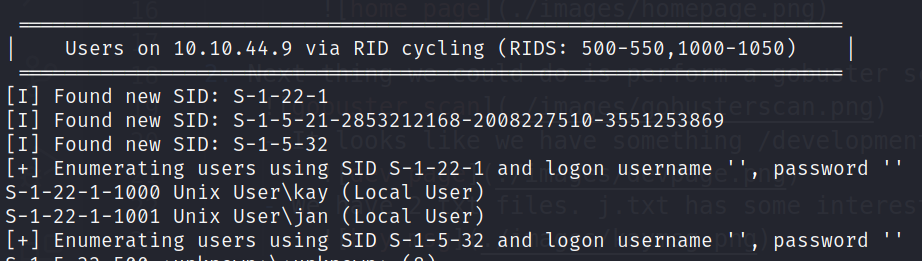
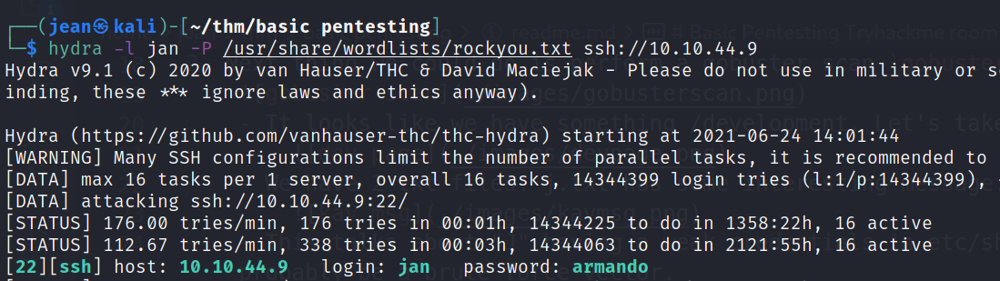
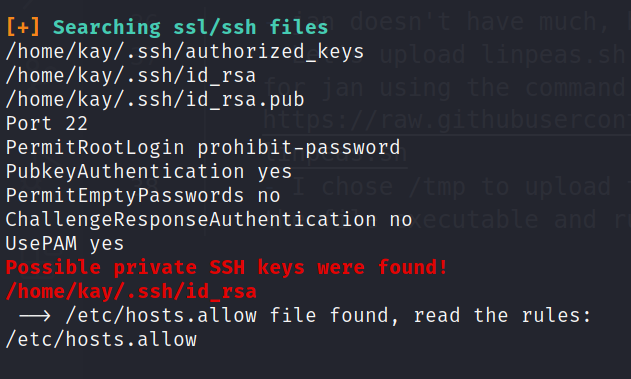
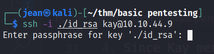
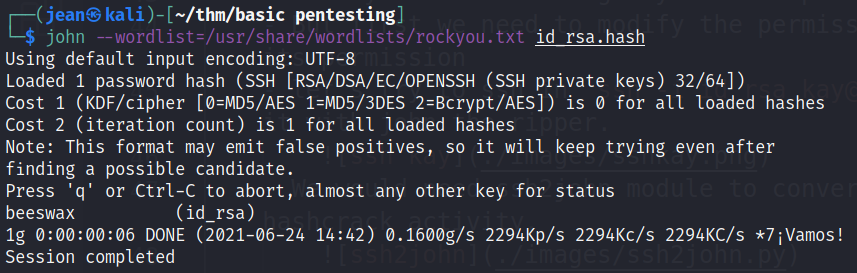

# Basic Pentesting Tryhackme room
my machine ip: 10.9.234.242
target ip: 10.10.44.9

### Objective
- brute forcing
- hash cracking
- service enumeration
- Linux enumration

#### Process

1. Perform nmap scan `nmap -sC -sV 10.10.44.9`
    
    - Port 80 is open and running an Apache server. So we know there would be a php website hosted there. When I visited the website it is under maintenance and doesn't have any contents, but it does have a clue commented out when you view the page source.
        

2. Next thing we could do is perform a gobuster scan `gobuster dir -w <path to wordlist> -u http://10.10.44.9`
    
    - It looks like we have something /development. Let's take a look
        
    - We have 2 txt files. j.txt has some interesting message.
        
    - This talks about "J" having a weak credentials in etc/shadow. Once we identify "J" username we it could probably be a brute force vector.

3. perform enum4linux scan `enum4linux.pl 10.10.44.9` to get details from the Samba systems. We might also get a username
    - If you don't have the file, you can download it here https://github.com/CiscoCXSecurity/enum4linux/blob/master/enum4linux.pl
    - We got 2 users from the scan.
        

4. Since Kay mentioned in the .txt file that jan has a week password, we can perform a brute force attach on Jan's ssh access, since port 22 is open. Let's use Hydra. `hydra -l jan -P <path to wordlist> ssh://10.10.44.9`
    
    - We got the ssh access for jan

5. Let's ssh in to the machine as jan, using the credentials that we got.
    - jan doesn't have much, but there's another user existing in the box that we can try to hack, kay.
    - Let's upload linpeas.sh to help us enumrate for privilege escalation. Let's first find a writable directory for jan using the command `find / -writable 2</dev/null` and upload linpeas.sh. Here's the link to linpeas https://raw.githubusercontent.com/carlospolop/privilege-escalation-awesome-scripts-suite/master/linPEAS/linpeas.sh
    - I chose /tmp to upload the file using scp command `scp ./linpeas.sh jan@10.10.44.9:/tmp`, then let's make the file executable and run it.
    - linpeas was able to find some interesting stuff for us. It's kay's private ssh keys.
        
    - Let's copy the content of the private ssh key and add it in our local machine

6. Let's try to ssh in using kay and the private ssh key we found. Hopefully there's no password for this.
    - But first we need to modify the permission to `chmod 600 id_rsa` because that's how the ssh command likes its permission
    - let's try to ssh in `ssh -i id_rsa kay@10.10.44.9`. it looks like it needs a passphrase. Let's try to crack it with john the ripper.
        
    - We would need ssh2john module to convert it into a readable format to john before proceeding with the hashcrack activity.
        
    - after that we can now use john to hashcrack the passphrase for the private ssh key of kay `john --wordlist=<path to wordlist> id_rsa.hash`
        
    - that was quick. let's try to ssh in using the priv key and the passphrase we had.
    - you'll find you answer located at /home/kay
