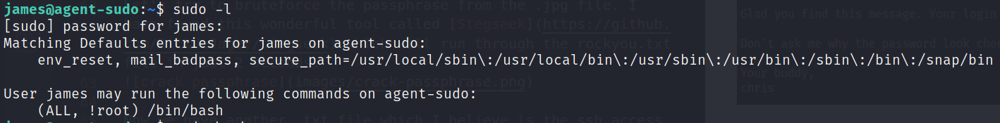

# TryHackMe CTF challenge Agent Sudo room
My machine: 10.9.234.242
target: 10.10.222.43

## procedure

Perform nmap scan `nmap -sC -sV 10.10.222.43`
```
Starting Nmap 7.91 ( https://nmap.org ) at 2021-08-01 23:33 PST
Nmap scan report for 10.10.222.43
Host is up (0.24s latency).
Not shown: 997 closed ports
PORT   STATE SERVICE VERSION
21/tcp open  ftp     vsftpd 3.0.3
22/tcp open  ssh     OpenSSH 7.6p1 Ubuntu 4ubuntu0.3 (Ubuntu Linux; protocol 2.0)
| ssh-hostkey: 
|   2048 ef:1f:5d:04:d4:77:95:06:60:72:ec:f0:58:f2:cc:07 (RSA)
|   256 5e:02:d1:9a:c4:e7:43:06:62:c1:9e:25:84:8a:e7:ea (ECDSA)
|_  256 2d:00:5c:b9:fd:a8:c8:d8:80:e3:92:4f:8b:4f:18:e2 (ED25519)
80/tcp open  http    Apache httpd 2.4.29 ((Ubuntu))
|_http-server-header: Apache/2.4.29 (Ubuntu)
|_http-title: Annoucement
Service Info: OSs: Unix, Linux; CPE: cpe:/o:linux:linux_kernel

Service detection performed. Please report any incorrect results at https://nmap.org/submit/ .
Nmap done: 1 IP address (1 host up) scanned in 35.87 seconds
```

run gobuster scan `gobuster dir <wordlist path> -u http://10.10.222.43 -x php,py,sh,html,htm,cgi,bak,txt -t100` to enumarate if there are any common dirs that we can access

go to your browser and download an extension called user agent switcher. In my case for firefox, I have installed the `user-Agent Switcher and Manager` plugin and change the user-agent name as `C`


Now we got redirected to this page where it tells that user `chris` has a weak credentials


Let's try to bruteforce with hydra the ftp server using `chris` as the username and rockyou.txt for the password list


I have downloaded 3 files from the ftp server of `chris`. The .txt file provided a hint that there would files that are stored in the 2 pictures.


Extract the zip files within `cutie.png` file using binwalk `binwalk -e cutie.png` and go to the extracted directory.


We would need to crack 8702.zip file to get the .txt contents. Unfortunately this is a password protected zip. Let's use john the ripper to bruteforce it. Peform the following command:
```
./zip2john 8702.zip > crackme.hashes
./john -wordlist=rockyou.txt crackme.hashes
```
Then you'll get the password


we have extracted the contents of the text file. unfortunately it is still unclear regarding the message. This is not a password to anything.


Let's try to bruteforce the passphrase from the .jpg file. I have found this wonderful tool called [Stegseek](https://github.com/RickdeJager/stegseek) which will run through the rockyou.txt file in just 2 seconds. 


Now we have another .txt file which I believe is the ssh access for the user `james`


We can see the user flag once logged in


Now we need to find a priv escalation vector. Run the command `sudo -l` as james in the target machine.

Research on the `CVE-2019-14287` and perform the priv escalation. You'll find the final flag in the root dir.



(Bonus) Who is Agent R? - Check who rote the last flag ;)

