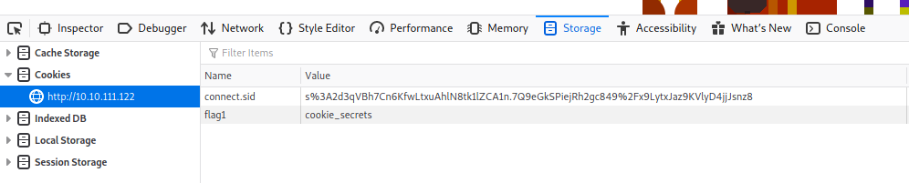
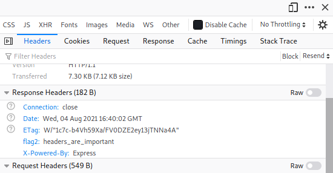
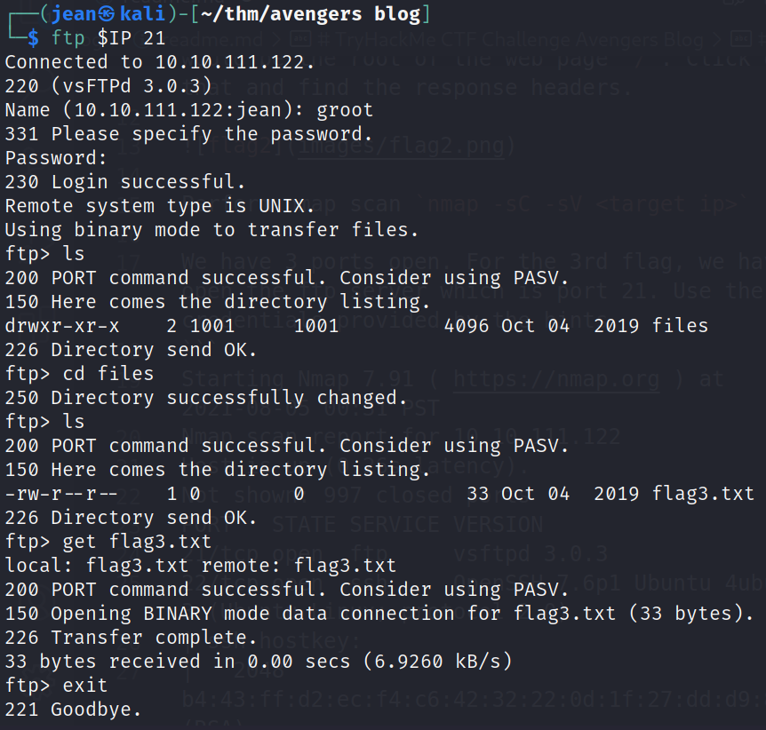
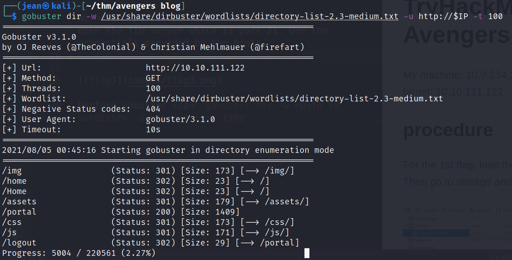
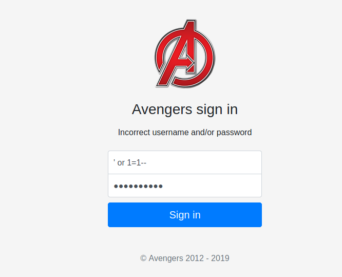
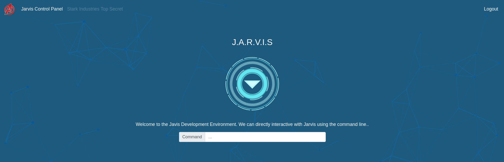

# TryHackMe CTF Challenge Avengers Blog
My machine: 10.9.234.242
target: 10.10.111.122

## procedure

For the 1st flag, load the page and go to your browser console. Then go to storage and find the cookie that is named `flag1`



For the 2nd flag, open the browser console again and go to the network tab. Refresh the page and find find the first file that was loaded which would be the root of the web page `/`. Click on that and find the response headers.



Perform nmap scan `nmap -sC -sV <target ip>`

We have 3 ports open. For the 3rd flag, we have to open the ftp server which is port 21. Use the credentials provided by the hints.
```
Starting Nmap 7.91 ( https://nmap.org ) at 2021-08-05 00:31 PST
Nmap scan report for 10.10.111.122
Host is up (0.26s latency).
Not shown: 997 closed ports
PORT   STATE SERVICE VERSION
21/tcp open  ftp     vsftpd 3.0.3
22/tcp open  ssh     OpenSSH 7.6p1 Ubuntu 4ubuntu0.3 (Ubuntu Linux; protocol 2.0)
| ssh-hostkey: 
|   2048 b4:43:ff:d2:ec:f4:c6:42:32:22:0d:1f:27:dd:d9:87 (RSA)
|   256 95:80:11:e4:9b:a8:b4:69:9f:be:f1:65:46:76:a2:7c (ECDSA)
|_  256 f9:7a:6b:5b:64:6e:8a:34:1a:cb:36:24:b4:4b:a4:ce (ED25519)
80/tcp open  http    Node.js Express framework
|_http-title: Avengers! Assemble!
Service Info: OSs: Unix, Linux; CPE: cpe:/o:linux:linux_kernel

Service detection performed. Please report any incorrect results at https://nmap.sorg/submit/ .
Nmap done: 1 IP address (1 host up) scanned in 45.47 seconds
```



Perform gobuster scan `gobuster dir -w <path to wordlist> -u <target ip> -t100` and get the directory login page.



Go to `/portal` and perform a basic sql injection to login in to the page. just type in `' or 1=1--` for both fields.



We're in!



For the last flag. I want you to research about different ways to read a file aside from cat. The last flag will be located one directory above. Enjoy!
