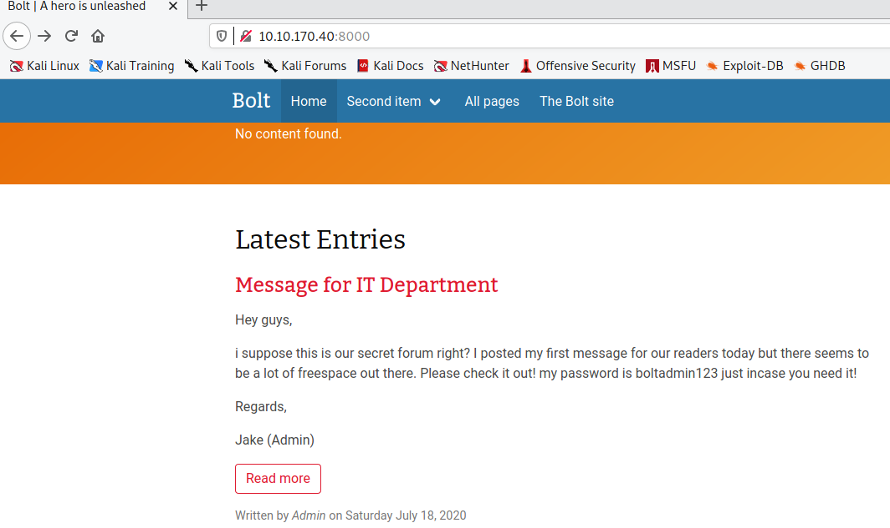
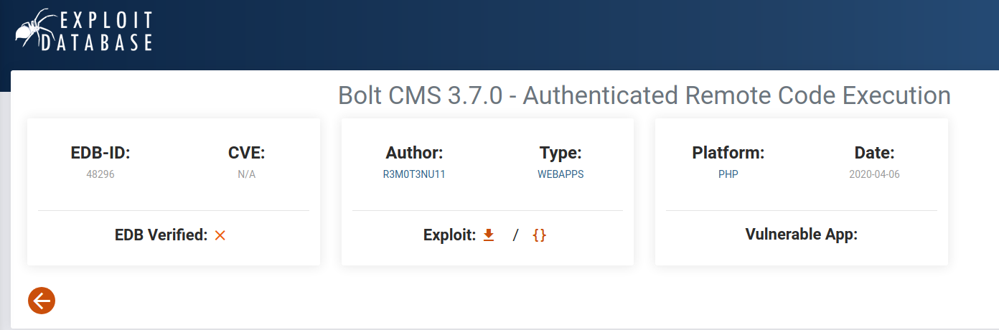

# tryhackme ctf challenge Bolt room
my ip: 10.9.234.242
target: 10.10.170.40

## procedure
perform nmap scan `nmap -sC -sV 10.10.170.40`

```
PORT     STATE SERVICE VERSION
22/tcp   open  ssh     OpenSSH 7.6p1 Ubuntu 4ubuntu0.3 (Ubuntu Linux; protocol 2.0)
| ssh-hostkey: 
|   2048 f3:85:ec:54:f2:01:b1:94:40:de:42:e8:21:97:20:80 (RSA)
|   256 77:c7:c1:ae:31:41:21:e4:93:0e:9a:dd:0b:29:e1:ff (ECDSA)
|_  256 07:05:43:46:9d:b2:3e:f0:4d:69:67:e4:91:d3:d3:7f (ED25519)
80/tcp   open  http    Apache httpd 2.4.29 ((Ubuntu))
|_http-server-header: Apache/2.4.29 (Ubuntu)
|_http-title: Apache2 Ubuntu Default Page: It works
8000/tcp open  http    (PHP 7.2.32-1)
```

Looks like port 80 is just an apache home page. Lets check out port 8000 where the boltcms is running.



As you can see within the homepage, the admin just gave its password. Now lets try to find the username.


in `/entry/message-from-admin` this directory contains the username.

Now with a bit of googling, I was able to find the login page for the admin for boltcms which is `/bolt/login`. We can try to use the credentials that we found earlier.


Success! You can get the version of bolt on the bottom of the screen.

Now lets try to search for bolt cms exploits in exploitdb.com



Get the EDB-ID and put it in tryhackme.

Now lets openup metasploit and search for botl cms exploits again.


use the RCE exploit and set the appropriate options to metasploit.


then run the exploit and now we're root.


