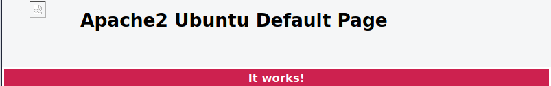
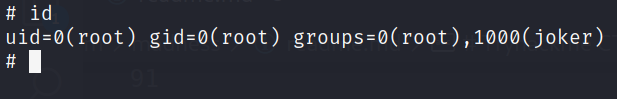

# Tryhackme CTF room Madness
my machine: 10.9.234.242
target: 10.10.97.6

## procedure

perform nmap scan `nmap -sV <target ip>`
```
Starting Nmap 7.91 ( https://nmap.org ) at 2021-08-14 12:20 PST
Nmap scan report for 10.10.97.6
Host is up (0.26s latency).
Not shown: 998 closed ports
PORT   STATE SERVICE VERSION
22/tcp open  ssh     OpenSSH 7.2p2 Ubuntu 4ubuntu2.8 (Ubuntu Linux; protocol 2.0)
80/tcp open  http    Apache httpd 2.4.18 ((Ubuntu))
Service Info: OS: Linux; CPE: cpe:/o:linux:linux_kernel

Service detection performed. Please report any incorrect results at https://nmap.org/submit/ .
Nmap done: 1 IP address (1 host up) scanned in 49.08 seconds
```

Let's check the website.



This is the default apache page and it looks there's something on the header. Let's check it out


We have thm.jpg which is a bit weird because it wont open. Lets download it using wget.


it's suppose to be jpg, but lets check the hex values of the file


the magic number is in png. lets try to change the hex value

```
89 50 4E 47  0D 0A 1A 0A => FF D8 FF E0  00 10 4A 46
```

and open it in firefox


Finally, I found a directory (I initially ran gobuster, but it did not discovered any new directories)

now lets go to this directory


It wants us to enumerate its secret between 0-99. it should looks something like this `http://10.10.97.6/th1s_1s_h1dd3n?secret=0`

Ill be using burpsuite here to bruteforce the url parameter to get us the secret message. First off lets create the payload. I have created a python script to generate the number 0-99

```
#! /usr/bin/env python3

end = 100
file_object = open('payload.txt', 'a')

for n in range(end):
    file_object.write(f"{str(n)}\n")

print('done!')
```

now try to capture this request url `http://10.10.97.6/th1s_1s_h1dd3n?secret=0` in burpsuite and send it to intruder.


don't forget to add our payload and start the attack.


It looks like we have a weird txt. This must be the password of the stego file.


decode the `wbxre` using rot13 and you'll get the proper username.

Now that we have a username, the password can be found in another stego file. 


wget the file and you'll get the password. Now we can ssh in to the machine and get the first flag

Now that we're in let's try to find privesc vector. I'll be using linpeas. u can upload it using scp.


There's a weird binary suid that we found.


Let's search for an specific exploit.


It looks like we have something good in exploitdb, lets create a shell file in the target machine and make it executable, then run it.


