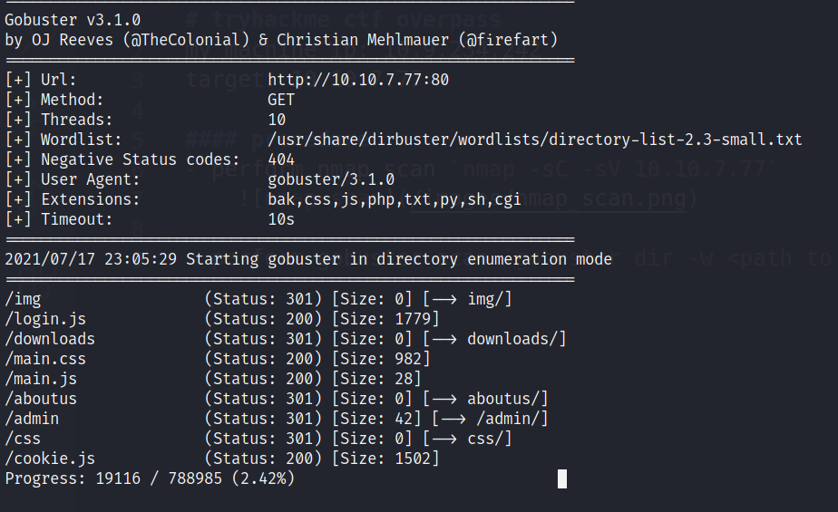

# tryhackme ctf overpass
my machine ip: 10.9.234.242
target: 10.10.7.77

#### procedure
- perform nmap scan `nmap -sC -sV 10.10.7.77`
    

- since we know port 80 is open lets perform gobuster scan `gobuster dir -w <path to wordlist> -u http://10.10.7.77:80`
    

- lets go to `10.10.7.77/admin`
    

- go to page source and look into the login.js asset.
    
    - the login method sets a cookie "SessionToken" lets try to set it into any string using the browser console and reload the page `Cookies.set('SessionToken', 'anything')`

- we were able to login just by creating a cookie. now let's copy the private ssh keys from james into our local machine
    

- lets try to crack the passphrase of the priv ssh key using john the ripper. first is to use ssh2john.py to turn it into a readble format. Dont forget for private keys you have to set the permission to 600.
    

- lets crack it using john and rockyou.txt
    

- lets ssh in using james and the cracked passphrase.

- lets create a directory in our local machine `mkdir -p downloads/src`
    

- move the buildscript.sh file from the overpass website to the directory that we just created and `downloads/src` and replace the content with a reverse shell code.
    

- spawn a python web server `python3 -m http.server 80` and spawn a netcat listener `nc -lvnp <port>`
    
    

- change the ip address for overpass.thm from the target machine to your ip
    

- wait for the netcat listner to get the root shell.
